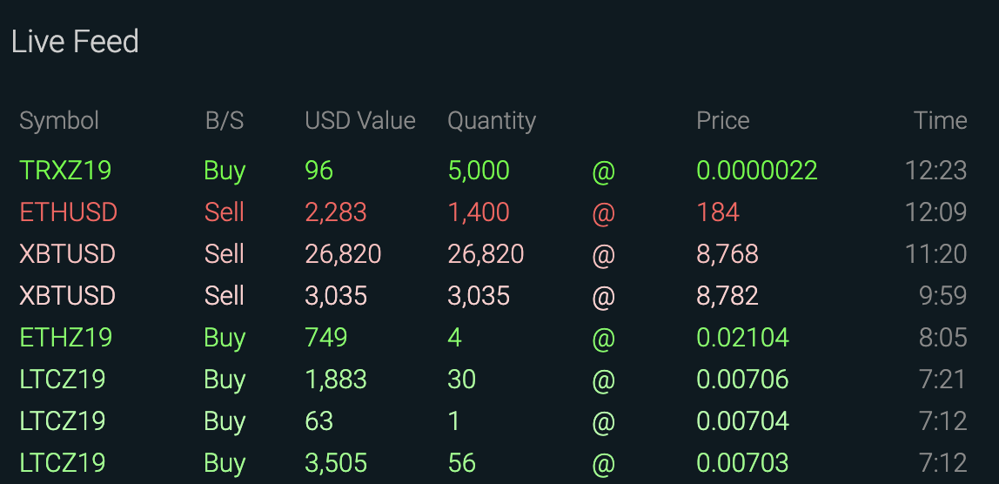

# BitMEX Liquidation
Minimal code to show how to receive the liquidations in realtime on Bitmex. It does work and does not hang randomly.

<p align="center">
  
</p>

## Installation
```
virtualenv -p python3 venv
source venv/bin/activate
pip install -r requirements.txt
```

## Run
```
python liquidate.py               # All instruments.
python liquidate.py XBTUSD        # Only XBTUSD.
```

Useful links: https://app.rek.to/

## Messages

This message corresponds to the first line of the banner:
```json
{ 
   "table":"liquidation",
   "action":"insert",
   "data":[ 
      { 
         "orderID":"8b4a95db-815a-f93a-c9a2-ffbbabeddbac",
         "symbol":"TRXZ19",
         "side":"Buy",
         "price":2.17e-06,
         "leavesQty":5000
      }
   ]
}
```
